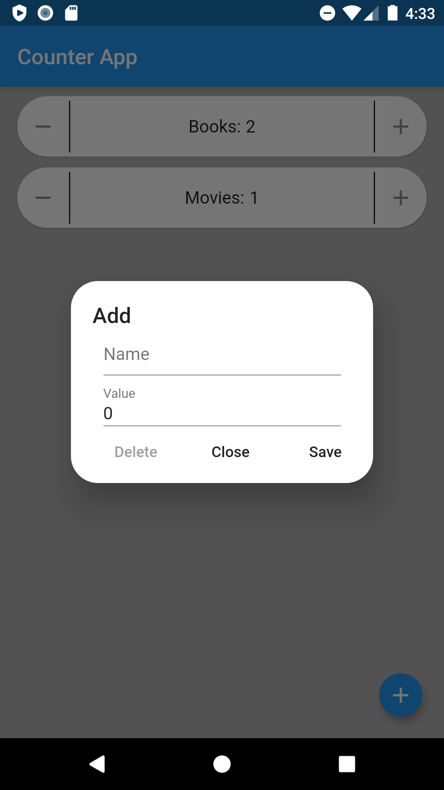
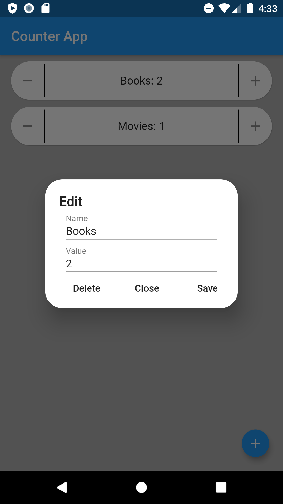

# flutter_counter

## About
Simple counter app made in flutter.

    
    
    

## Integration tests
To run integration tests connect device or start android emulator and run command in console

``
flutter drive --target=test_driver/app.dart
``
## License
Licensed under GNU GPL v3.0